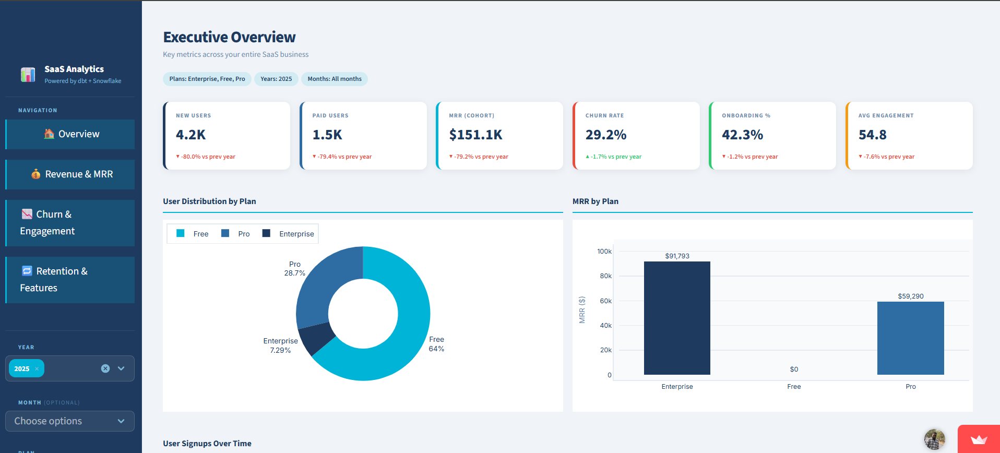
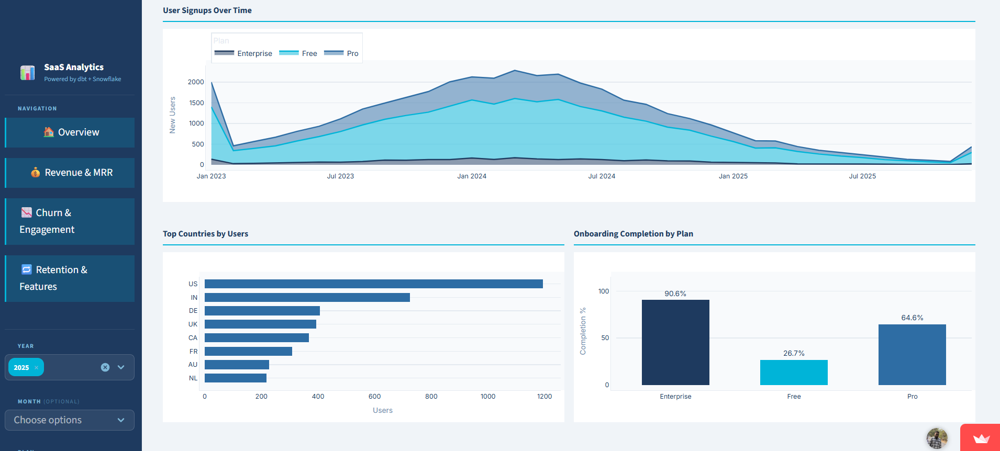
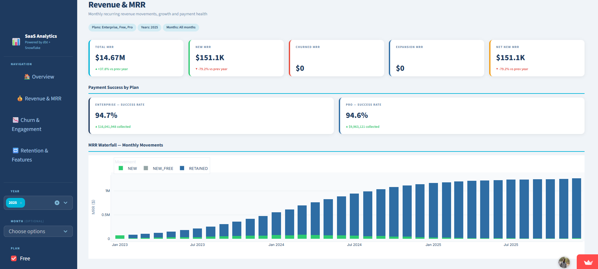
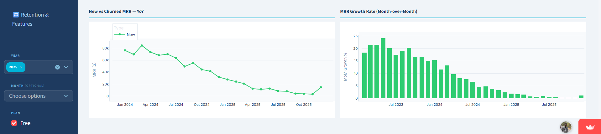
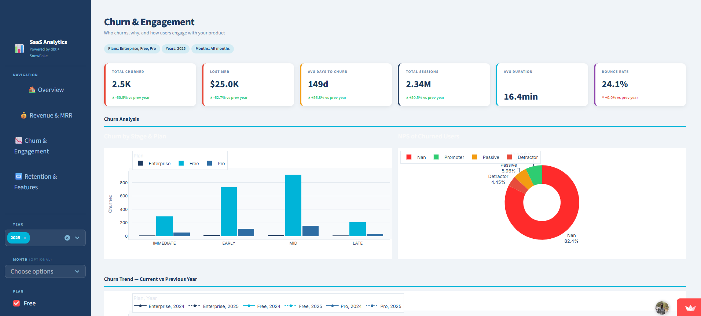
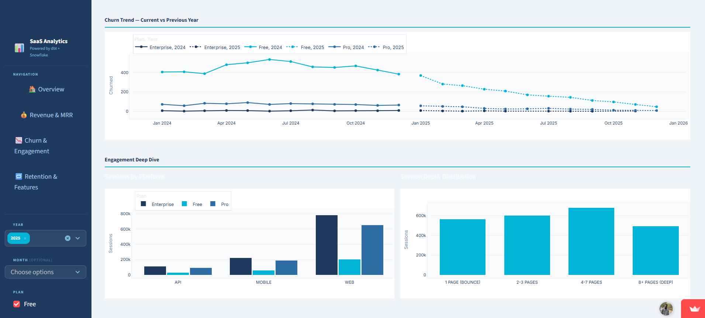
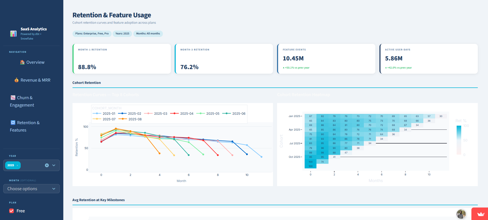
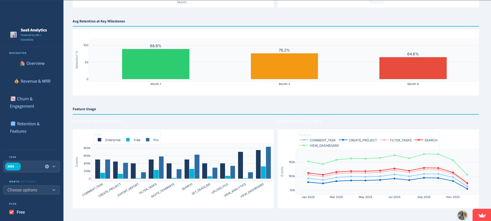

# SaaS Product Analytics

> End-to-end B2B SaaS analytics pipeline - synthetic data generation → Snowflake → dbt → Streamlit dashboard

[](https://python.org)
[](https://snowflake.com)
[](https://getdbt.com)
[](https://streamlit.io)
[](#dbt-models)
[](https://saasanalytics.streamlit.app/)

---
## What This Project Demonstrates
Built as a portfolio project to demonstrate end-to-end Analytics Engineering skills on a realistic B2B SaaS dataset:

- **Data modelling** — 3-layer dbt architecture (staging → intermediate → marts) with 16 models and 39 tests
- **Product analytics thinking** — answering real business questions around MRR, churn, retention, and feature adoption
- **Modern data stack** — Snowflake + dbt-core + Streamlit, the stack used at most analytics-forward companies
- **Data quality** — schema tests, not-null/unique/accepted-value constraints enforced across all mart tables
---

## 🔗 Live Dashboard

**[→ saasanalytics.streamlit.app](https://saasanalytics.streamlit.app/)**

## 📈 Executive Overview




---

## 💰 Revenue & MRR Analysis




---

## ⚠️ Churn & Engagement Insights




---

## 🔁 Retention & Feature Usage




---

## Architecture

```
┌──────────────────────┐    ┌──────────────────┐    ┌─────────────────────┐    ┌──────────────────┐
│  generate_saas_      │    │    Snowflake      │    │       dbt           │    │    Streamlit     │
│  data.py             │───▶│  9 raw tables     │───▶│  16 models          │───▶│  Dashboard       │
│  45.6M rows          │    │  ~$1.26M MRR      │    │  3 layers           │    │  4 pages         │
│  Python / NumPy      │    │  40K users        │    │  39 tests passing   │    │  Live on Cloud   │
└──────────────────────┘    └──────────────────┘    └─────────────────────┘    └──────────────────┘
```

**dbt layer detail:**
```
staging/          ← 1:1 with raw source tables, light cleaning + casting only
  stg_users · stg_sessions · stg_pages · stg_tracks
  stg_payments · stg_subscriptions · stg_plan_changes · stg_support_tickets

intermediate/     ← business logic joins, not exposed to BI tools
  int_monthly_revenue   (MRR movement classification per user per month via LAG)
  int_user_activity     (session + feature aggregates per user)

marts/            ← analytics-ready, one table per business domain
  core/
    dim_users         (user dimension: plan, MRR, lifecycle flags, engagement score)
    fct_retention     (cohort retention rates by month since signup)
  finance/
    fct_mrr           (monthly MRR: new / expansion / contraction / churn / retained)
    fct_churn         (churned users with engagement signals pre-churn)
  product/
    fct_sessions      (session aggregates by platform, depth bucket, duration bucket)
    fct_feature_usage (feature event counts by plan, month, platform)
```

---

## dbt Models

| Model | Layer | Materialisation | Description |
|---|---|---|---|
| `stg_users` | Staging | View | User profiles — cast, rename, plan normalisation |
| `stg_sessions` | Staging | View | Session events — timestamps, duration, page counts |
| `stg_pages` | Staging | View | Page view events |
| `stg_tracks` | Staging | View | Feature interaction events |
| `stg_payments` | Staging | View | Payment transactions |
| `stg_subscriptions` | Staging | View | Subscription lifecycle records |
| `stg_plan_changes` | Staging | View | Upgrade / downgrade events |
| `stg_support_tickets` | Staging | View | Support ticket history |
| `int_monthly_revenue` | Intermediate | View | MRR movement per user per month — LAG-based classification into new / expansion / contraction / churn / retained |
| `int_user_activity` | Intermediate | View | Aggregated session + feature metrics per user |
| `dim_users` | Mart | Table | User dimension with MRR, plan, engagement score, churn flag, onboarding status |
| `fct_retention` | Mart | Table | Cohort retention — % of users still active N months after signup |
| `fct_mrr` | Mart | Table | Monthly MRR waterfall by plan and movement type, with dedicated new/expansion/churned/retained columns |
| `fct_churn` | Mart | Table | Churned users enriched with days-to-churn, NPS category, pre-churn bounce rate and session counts |
| `fct_sessions` | Mart | Table | Session aggregates by plan, platform, depth bucket, duration bucket |
| `fct_feature_usage` | Mart | Table | Feature event counts and unique users by plan, month, platform |

**Tests: 39 passing** — `not_null`, `unique`, `accepted_values`, `relationships` across all mart tables.

---

## Business Questions Answered

The dashboard surfaces answers to the product analytics questions a Head of Product, Growth, or Revenue team asks regularly:

**Revenue & MRR**
- What is our MRR trend? How much is new vs expansion vs churned?
- Which plan drives the most revenue? Is enterprise MRR growing?
- What is our month-over-month MRR growth rate?

**Churn**
- How many users churned this period vs last year?
- Do churned users show lower session counts or higher bounce rates before churning?
- At which lifecycle stage (immediate / early / mid / late) do most users churn?
- What is the NPS breakdown of churned users?

**Retention**
- What % of a cohort is still active 1, 3, 6, and 12 months after signup?
- Which signup cohorts retain best?

**Feature & Engagement**
- Which features are most adopted across Free, Pro, and Enterprise plans?
- What is the session depth and duration distribution by plan?
- Which platforms (web, mobile, desktop) drive the most engagement?

---

## Data at a Glance

| Source Table | Rows | Description |
|---|---|---|
| `raw_pages` | 22,088,021 | Page view events |
| `raw_tracks` | 18,899,450 | Feature interaction events |
| `sessions` | 4,221,361 | User sessions |
| `payments` | 271,549 | Payment transactions |
| `users` | 40,000 | User profiles |
| `raw_identifies` | 40,000 | Signup identity events |
| `subscriptions` | 40,000 | Subscription records |
| `support_tickets` | 24,224 | Support history |
| `plan_changes` | 2,767 | Upgrades / downgrades |
| **Total** | **45,647,412** | |

**Business snapshot:** ~$1.26M active MRR · 38.6% free churn · 14.1% pro churn · 5.4% enterprise churn

---

## Project Structure

```
saas-product-analytics/
│
├── generate_saas_data.py        # Synthetic data generator (45.6M rows)
├── snowflake_load.sql           # Snowflake stage + COPY INTO for all 9 tables
├── requirements.txt             # Python dependencies
│
├── saas_dbt/                    # dbt project
│   ├── dbt_project.yml
│   ├── models/
│   │   ├── staging/             # 8 staging views
│   │   ├── intermediate/        # 2 intermediate views
│   │   └── marts/               # 6 mart tables
│   │       ├── core/
│   │       ├── finance/
│   │       └── product/
│   └── README.md
│
└── streamlit_dashboard/         # Streamlit app
    ├── app.py                   # Main dashboard — 4 pages, sidebar nav
    ├── requirements.txt         # streamlit, pandas, plotly
    └── .streamlit/
        └── config.toml          # Theme colours
```

> `data/` is gitignored — regenerate locally with `python generate_saas_data.py`

---

## How to Run Locally

**Prerequisites:** Python 3.11+, a Snowflake account, dbt-snowflake installed

### 1 — Generate the data
```bash
pip install -r requirements.txt
python generate_saas_data.py
# Writes 9 CSVs to data/  (~3–5 min)
```

### 2 — Load into Snowflake
Run `snowflake_load.sql` in a Snowflake worksheet. Creates the database, warehouse, stage, and loads all 9 tables via `COPY INTO`.

### 3 — Run dbt
```bash
cd saas_dbt
# Add your Snowflake credentials to profiles.yml (see saas_dbt/README.md)
dbt debug    # verify connection
dbt run      # build all 16 models
dbt test     # 39 tests — all should pass
```

### 4 — Run the dashboard
```bash
cd ../streamlit_dashboard
pip install -r requirements.txt
# Export mart tables to streamlit_dashboard/data/exports/ using snowflake_export_queries.sql
streamlit run app.py
```

---

## Tech Stack

| Layer | Tool | Purpose |
|---|---|---|
| Data generation | Python 3.11 · pandas · numpy · faker | Realistic synthetic B2B SaaS dataset |
| Data warehouse | Snowflake | Cloud DWH — all transformations execute here |
| Transformations | dbt-core 1.11 · dbt-snowflake | Staging → intermediate → mart models |
| Dashboard | Streamlit 1.32 · Plotly | 4-page interactive analytics app |
| Deployment | Streamlit Cloud | Free-tier hosting, CSV-based (no live DWH connection needed) |

---

*For dbt model SQL, YAML definitions, and test configs — see [`saas_dbt/`](saas_dbt/)*
